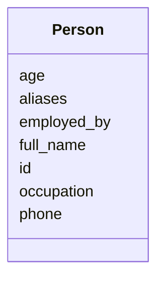

# Class: Person


URI: [personinfo:Person](https://w3id.org/linkml/examples/personinfoPerson)





<!-- no inheritance hierarchy -->


## Slots

| Name | Cardinality and Range | Description | Inheritance |
| ---  | --- | --- | --- |
| [id](id.md) | 0..1 <br/> [String](String.md) |  | direct |
| [full_name](full_name.md) | 0..1 <br/> [String](String.md) |  | direct |
| [aliases](aliases.md) | 0..1 <br/> [String](String.md) |  | direct |
| [phone](phone.md) | 0..1 <br/> [String](String.md) |  | direct |
| [age](age.md) | 0..1 <br/> [String](String.md) |  | direct |
| [occupation](occupation.md) | 0..1 <br/> [String](String.md) |  | direct |
| [employed_by](employed_by.md) | 0..1 <br/> [String](String.md) |  | direct |


## Identifier and Mapping Information


### Schema Source


* from schema: https://w3id.org/linkml/examples/personinfo


## Mappings

| Mapping Type | Mapped Value |
| ---  | ---  |
| self | personinfo:Person |
| native | personinfo:Person |


## LinkML Source

<!-- TODO: investigate https://stackoverflow.com/questions/37606292/how-to-create-tabbed-code-blocks-in-mkdocs-or-sphinx -->

### Direct

<details>
```yaml
name: Person
from_schema: https://w3id.org/linkml/examples/personinfo
attributes:
  id:
    name: id
    from_schema: https://w3id.org/linkml/examples/personinfo
    rank: 1000
    domain_of:
    - Person
  full_name:
    name: full_name
    from_schema: https://w3id.org/linkml/examples/personinfo
    rank: 1000
    domain_of:
    - Person
  aliases:
    name: aliases
    from_schema: https://w3id.org/linkml/examples/personinfo
    rank: 1000
    domain_of:
    - Person
  phone:
    name: phone
    from_schema: https://w3id.org/linkml/examples/personinfo
    rank: 1000
    domain_of:
    - Person
  age:
    name: age
    from_schema: https://w3id.org/linkml/examples/personinfo
    rank: 1000
    domain_of:
    - Person
  occupation:
    name: occupation
    from_schema: https://w3id.org/linkml/examples/personinfo
    rank: 1000
    domain_of:
    - Person
  employed_by:
    name: employed_by
    from_schema: https://w3id.org/linkml/examples/personinfo
    rank: 1000
    domain_of:
    - Person

```
</details>

### Induced

<details>
```yaml
name: Person
from_schema: https://w3id.org/linkml/examples/personinfo
attributes:
  id:
    name: id
    from_schema: https://w3id.org/linkml/examples/personinfo
    rank: 1000
    alias: id
    owner: Person
    domain_of:
    - Person
    range: string
  full_name:
    name: full_name
    from_schema: https://w3id.org/linkml/examples/personinfo
    rank: 1000
    alias: full_name
    owner: Person
    domain_of:
    - Person
    range: string
  aliases:
    name: aliases
    from_schema: https://w3id.org/linkml/examples/personinfo
    rank: 1000
    alias: aliases
    owner: Person
    domain_of:
    - Person
    range: string
  phone:
    name: phone
    from_schema: https://w3id.org/linkml/examples/personinfo
    rank: 1000
    alias: phone
    owner: Person
    domain_of:
    - Person
    range: string
  age:
    name: age
    from_schema: https://w3id.org/linkml/examples/personinfo
    rank: 1000
    alias: age
    owner: Person
    domain_of:
    - Person
    range: string
  occupation:
    name: occupation
    from_schema: https://w3id.org/linkml/examples/personinfo
    rank: 1000
    alias: occupation
    owner: Person
    domain_of:
    - Person
    range: string
  employed_by:
    name: employed_by
    from_schema: https://w3id.org/linkml/examples/personinfo
    rank: 1000
    alias: employed_by
    owner: Person
    domain_of:
    - Person
    range: string

```
</details>